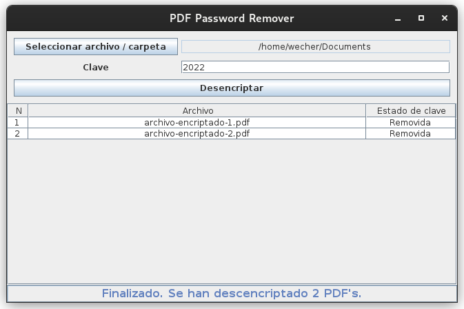

# PDF Password Remover
Massively remove passwords from PDF files.

## Stats

        
    
    
    
    

## [English]

#### Operation in files:
* Select a PDF file
* Enter the password
* If the password is correct, it will be removed from the file

#### Operation in folders:
* Select a folder
* Enter the password
* All the contents of the folder and subfolders will be searched recursively for PDF files that have a key
* The key will be removed from all of them

## [Spanish]
##### Funcionamiento en archivos:
* Selecciona un archivo de tipo PDF
* Introduce la clave
* En caso de que la clave sea correcta se removerá del archivo

##### Funcionamiento en carpetas:
* Selecciona una carpeta
* Introduce la clave
* Se buscara recursivamente en todo el contenido de la carpeta y subcarpetas los archivos de tipo PDF que tengan clave
* Se removerá la clave de todos ellos

---

## Screenshots

# 
</img>

